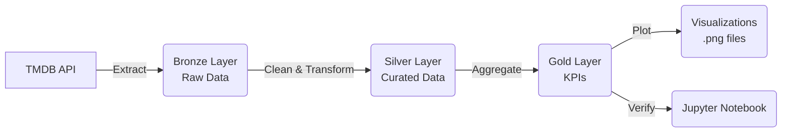

# Movie Data Pipeline

A robust end-to-end data pipeline that fetches movie data from the TMDB API, processes it through a multi-hop architecture (Bronze $\rightarrow$ Silver $\rightarrow$ Gold), calculates key business metrics, and generates visualizations.

## Architecture

The pipeline follows the Medallion Architecture pattern:

1.  **Bronze Layer (Ingestion)**: Raw JSON/Parquet data fetched from the TMDB API.
2.  **Silver Layer (Transformation)**: Cleaned, de-duplicated, and schema-enforced data (flattened structures, type casting).
3.  **Gold Layer (Analytics)**: Aggregated Key Performance Indicators (KPIs) ready for reporting.
4.  **Visualization**: Charts and graphs generated from Gold data.



##  Project Structure

```text
movie-data-pipeline/
├── ingestion/
│   └── fetch_movies.py       # Step 1: Fetches data from API -> Bronze
├── transform/
│   └── clean_transform.py    # Step 2: Cleans data -> Silver
├── analytics/
│   └── kpis.py               # Step 3: Calculates metrics -> Gold
├── visualization/
│   └── visualize.py          # Step 4: Generates charts -> data/visualizations
├── notebooks/
│   └── pipeline_verification.ipynb # Verification & Data Inspection
├── data/                     # Data storage (created automatically)
│   ├── bronze/
│   ├── silver/
│   ├── gold/
│   └── visualizations/
├── .env                      # API Credentials
├── requirements.txt          # Python dependencies
└── README.md                 # This documentation
```

## Getting Started

### Prerequisites

- **Python 3.8+**
- **Java (JDK 8 or 11)**: Required for PySpark.
- **TMDB API Key**: Get one [here](https://www.themoviedb.org/documentation/api).

### 1. Environment Setup

1.  Clone the repository.
2.  Create a `.env` file in the root directory:
    ```env
    TMDB_API_KEY=your_actual_api_key_here
    ```
3.  Install dependencies:
    ```bash
    pip install -r requirements.txt
    pip install pyspark # If not already installed
    ```

## How to Run the Pipeline

Follow these steps in order to populate the data layers.

### Step 1: Ingestion (Bronze)

Fetches movies (e.g., top 500 revenue, popular) and saves them as raw Parquet files.

```bash
python ingestion/fetch_movies.py
```

_Output: `data/bronze/movies/ingestion_date=.../movies_raw.parquet`_

### Step 2: Transformation (Silver)

Cleans the raw data (explodes genres, handles nulls, calculates profit).

```bash
python transform/clean_transform.py
```

_Output: `data/silver/movies_curated/`_

### Step 3: Analytics (Gold)

Calculates KPIs like Highest ROI, Top Genres, and Franchise Performance.

```bash
python analytics/kpis.py
```

_Output: `data/gold/highest_revenue/`, `data/gold/franchise_vs_standalone/`, etc._

### Step 4: Visualization

Generates profit charts, correlation heatmaps, and trend lines.

```bash
python visualization/visualize.py
```

_Output: PNG files in `data/visualizations/`_

## Verification

We have provided a Jupyter Notebook to interactively verify the results and inspect the data at every stage.

1.  Open the notebook:
    ```bash
    jupyter notebook notebooks/pipeline_verification.ipynb
    ```
2.  Run the cells to see:
    - Raw data samples.
    - Cleaned dataframe schemas.
    - Specific KPI values (e.g., `get_kpi("highest_profit")`).
    - Embedded visualization images.

##  Data Layers Detail

| Layer      | Description                                                                               | Path          |
| :--------- | :---------------------------------------------------------------------------------------- | :------------ |
| **Bronze** | Raw data from TMDB. Contains nested JSON strings and original schemas.                    | `data/bronze` |
| **Silver** | Curated table. Revenue/Budget converted to millions (musd), dates parsed, JSON flattened. | `data/silver` |
| **Gold**   | Aggregated business metrics. E.g., "Mean Revenue by Year", "Top 10 High ROI Movies".      | `data/gold`   |
